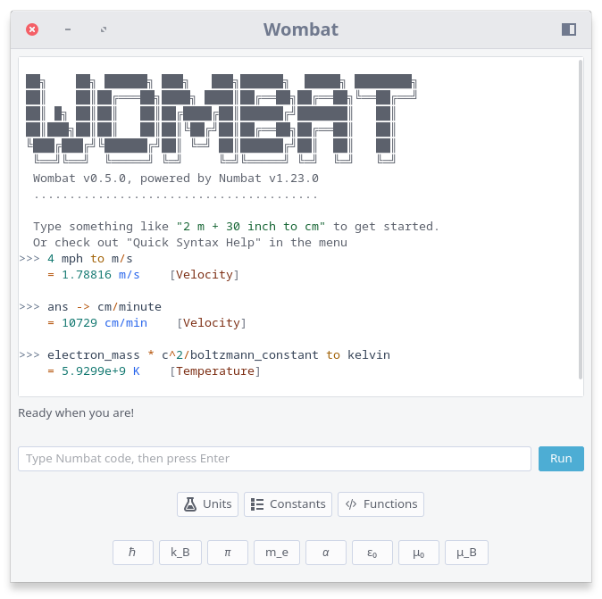

# Wombat

[](https://github.com/archisman-panigrahi/wombat/releases)
[](https://aur.archlinux.org/packages/wombat)
[](https://flathub.org/apps/details/io.github.archisman_panigrahi.wombat)

Wombat is a scientific calculator for GNU/Linux using [Numbat](https://github.com/sharkdp/numbat) programming language. It keeps a live Numbat interpreter session in memory and shows the full output history in a scrollable log.
Written in Rust, it uses GTK4+libadwaita and fully supports desktop and mobile devices running GNU/Linux. 

For Android and iOS, also see [Numbat-app](https://github.com/sharkdp/numbat-app), a similar cross-platform by Numbat's creator.



## Features

- High-precision scientific calculations powered by Numbat
- Physical units and dimensional analysis, including natural unit conversions
- Persistent live interpreter session for variables, functions, and imports
- Scrollable, syntax-highlighted calculation history
- Automatic completion suggestions for variables, functions, units, and constants
- Tappable/clickable suggestions for touch and pointer workflows
- Quick operator buttons for `+`, `-`, `*`, `/`, and `^`
- Quick-insert buttons for common physical constants
- Units, constants, and functions browsers with click-to-insert entries
- Custom startup definitions for your own variables, units, and functions
- Sidebar actions for syntax help, examples, reset, clear, fullscreen, and shortcuts
- Mobile-friendly responsive layout with touch-friendly controls
- Flatpak-friendly GTK/libadwaita interface for Linux desktops


## Planned features

See [Planned features](./todo.md).

## How to install?


### Arch Linux

Available on the [AUR](https://aur.archlinux.org/packages/wombat):

```
yay -S wombat
```

### Other distros

Published on the Flathub app store:

<a href='https://flathub.org/apps/io.github.archisman_panigrahi.wombat'>
    
</a>

Here is [how to set up Flathub](https://flathub.org/en/setup) on your distro so that you can install this app.


---

## How to build from source?

You need:

- Rust stable toolchain
- GTK 4 development files
- libadwaita development files
- `pkg-config`
- `git`

On Debian/Ubuntu, this is usually enough:

```bash
sudo apt install build-essential pkg-config libgtk-4-dev libadwaita-1-dev git
```

If you are using GNOME Builder, install it first and let it pull the platform dependencies it needs. For Builder/Flatpak, open the Flatpak manifest and use its simple buildsystem.

## Important: Cargo vs System Libraries

Cargo can install Rust crates, but it does not install native C libraries like GTK4 and libadwaita. The Rust crates (`gtk4`, `libadwaita`) are bindings and still require the platform development packages through `pkg-config`.

So you have two practical options:

- Native host build (APT packages plus Cargo)
- Flatpak/Builder build (GNOME runtime provides newer GTK/libadwaita)

For Debian packaging, this repository also includes a `debian/` directory that
builds against the system `librust-numbat-dev` crate when packaged there.

## Build And Run

From the project directory:

```bash
cargo run
```

If you want a release build:

```bash
cargo run --release
```

## Test Without GNOME Builder

You can test entirely from terminal in two ways.

### Option A: Native host run (fastest)

If your host has compatible GTK/libadwaita dev packages:

```bash
cargo run
```

If build fails with pkg-config errors (missing `gtk4.pc` or `graphene-gobject-1.0.pc`), use Option B.

### Option B: Flatpak terminal run (Builder-free, newer stack)

Install runtimes once:

```bash
flatpak install flathub org.gnome.Platform//50 org.gnome.Sdk//50 org.freedesktop.Sdk.Extension.rust-stable//25.08
```

Build and install locally:

```bash
flatpak-builder --user --install --force-clean .flatpak-build io.github.archisman_panigrahi.wombat.json
```

Run it:

```bash
flatpak run io.github.archisman_panigrahi.wombat
```

If you modify code and want a rebuild:

```bash
flatpak-builder --user --install --force-clean .flatpak-build io.github.archisman_panigrahi.wombat.json
flatpak run io.github.archisman_panigrahi.wombat
```

## GNOME Builder

1. Open GNOME Builder.
2. Choose Open Project.
3. Select this folder.
4. Open the Flatpak manifest `io.github.archisman_panigrahi.wombat.json`.
5. Build and run from inside Builder.

The manifest uses `org.gnome.Platform` + `org.gnome.Sdk`, a Rust SDK extension, and a simple buildsystem module that runs Cargo directly. That lets Builder build against the GNOME runtime even if your host APT versions are older.

If needed, install the runtimes manually:

```bash
flatpak install flathub org.gnome.Platform//50 org.gnome.Sdk//50 org.freedesktop.Sdk.Extension.rust-stable//25.08
```

You can also build from terminal with Flatpak tools:

```bash
flatpak-builder --user --install --force-clean .flatpak-build io.github.archisman_panigrahi.wombat.json
flatpak run io.github.archisman_panigrahi.wombat
```

Builder-friendly app metadata files are included in `data/` and installed by the manifest.

## Module Paths

At startup the app looks for Numbat modules in:

- `NUMBAT_MODULES_PATH` if it is set
- `$XDG_CONFIG_HOME/numbat/modules` or `~/.config/numbat/modules`
- `/usr/share/numbat/modules`
- Numbat’s built-in module set

The environment variable follows Numbat’s own convention and can contain a colon-separated list of directories on Linux.

Example:

```bash
export NUMBAT_MODULES_PATH="$HOME/.config/numbat/modules:/opt/numbat/modules"
cargo run
```
