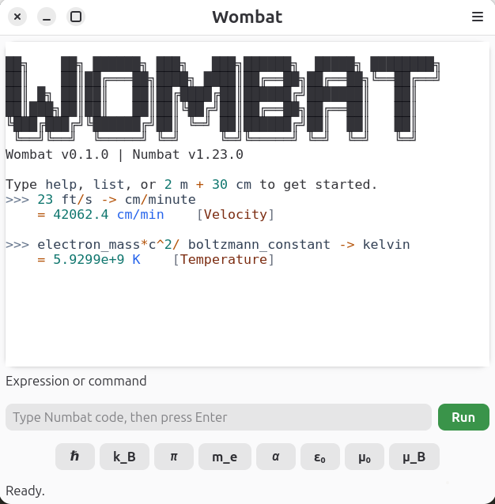

# Wombat

Wombat is a scientific calculator using [Numbat](https://github.com/sharkdp/numbat) programming language. It keeps a live Numbat interpreter session in memory and shows the full output history in a scrollable log. It uses GTK4+libadwaita.



## What Works Now

- Expression evaluation through Numbat’s interpreter
- Built-in REPL commands such as `help`, `list`, `info`, `clear`, `save`, `reset`, and `quit`
- A persistent scrollable history pane
- A single input field for expressions and commands
- Loading modules from Numbat’s built-in modules plus local module folders found at startup

The module-management GUI itself is intentionally left for a later iteration, but the app is already wired so external module paths can be discovered from the environment and the standard user/system folders.

## Requirements

You need:

- Rust stable toolchain
- GTK 4 development files
- libadwaita development files
- `pkg-config`
- `git`

On Debian/Ubuntu, this is usually enough:

```bash
sudo apt install build-essential pkg-config libgtk-4-dev libadwaita-1-dev git
```

If you are using GNOME Builder, install it first and let it pull the platform dependencies it needs. For Builder/Flatpak, open the Flatpak manifest and use its simple buildsystem.

## Important: Cargo vs System Libraries

Cargo can install Rust crates, but it does not install native C libraries like GTK4 and libadwaita. The Rust crates (`gtk4`, `libadwaita`) are bindings and still require the platform development packages through `pkg-config`.

So you have two practical options:

- Native host build (APT packages plus Cargo)
- Flatpak/Builder build (GNOME runtime provides newer GTK/libadwaita)

For Debian packaging, this repository also includes a `debian/` directory that
builds against the system `librust-numbat-dev` crate when packaged there.

## Build And Run

From the project directory:

```bash
cargo run
```

If you want a release build:

```bash
cargo run --release
```

## Test Without GNOME Builder

You can test entirely from terminal in two ways.

### Option A: Native host run (fastest)

If your host has compatible GTK/libadwaita dev packages:

```bash
cargo run
```

If build fails with pkg-config errors (missing `gtk4.pc` or `graphene-gobject-1.0.pc`), use Option B.

### Option B: Flatpak terminal run (Builder-free, newer stack)

Install runtimes once:

```bash
flatpak install flathub org.gnome.Platform//50 org.gnome.Sdk//50 org.freedesktop.Sdk.Extension.rust-stable//25.08
```

Build and install locally:

```bash
flatpak-builder --user --install --force-clean .flatpak-build io.github.archisman_panigrahi.wombat.json
```

Run it:

```bash
flatpak run io.github.archisman_panigrahi.wombat
```

If you modify code and want a rebuild:

```bash
flatpak-builder --user --install --force-clean .flatpak-build io.github.archisman_panigrahi.wombat.json
flatpak run io.github.archisman_panigrahi.wombat
```

## GNOME Builder

1. Open GNOME Builder.
2. Choose Open Project.
3. Select this folder.
4. Open the Flatpak manifest `io.github.archisman_panigrahi.wombat.json`.
5. Build and run from inside Builder.

The manifest uses `org.gnome.Platform` + `org.gnome.Sdk`, a Rust SDK extension, and a simple buildsystem module that runs Cargo directly. That lets Builder build against the GNOME runtime even if your host APT versions are older.

If needed, install the runtimes manually:

```bash
flatpak install flathub org.gnome.Platform//50 org.gnome.Sdk//50 org.freedesktop.Sdk.Extension.rust-stable//25.08
```

You can also build from terminal with Flatpak tools:

```bash
flatpak-builder --user --install --force-clean .flatpak-build io.github.archisman_panigrahi.wombat.json
flatpak run io.github.archisman_panigrahi.wombat
```

Builder-friendly app metadata files are included in `data/` and installed by the manifest.

## Module Paths

At startup the app looks for Numbat modules in:

- `NUMBAT_MODULES_PATH` if it is set
- `$XDG_CONFIG_HOME/numbat/modules` or `~/.config/numbat/modules`
- `/usr/share/numbat/modules`
- Numbat’s built-in module set

The environment variable follows Numbat’s own convention and can contain a colon-separated list of directories on Linux.

Example:

```bash
export NUMBAT_MODULES_PATH="$HOME/.config/numbat/modules:/opt/numbat/modules"
cargo run
```

## Notes

- The current input widget is a single-line entry. It is enough for most expressions and REPL commands, and can be upgraded to a multi-line editor later.
- A future pass can add an in-app module picker/editor panel for creating and managing custom `.nbt` files.
- If you want the same interpreter behavior as the Numbat CLI, keep this project synced with upstream Numbat API changes.
- The APT fallback can still work if your distro GTK/libadwaita versions satisfy the bindings in `Cargo.toml`.

## Repository Layout

- `Cargo.toml` - Rust package metadata and dependencies
- `debian/` - Debian packaging metadata and build rules
- `src/main.rs` - GTK window, Numbat session handling, and UI logic
- `README.md` - Setup and usage notes
- `io.github.archisman_panigrahi.wombat.json` - Flatpak manifest for GNOME Builder / Flatpak builds
- `data/io.github.archisman_panigrahi.wombat.desktop` - Desktop entry
- `data/io.github.archisman_panigrahi.wombat.metainfo.xml` - AppStream metadata
- `data/io.github.archisman_panigrahi.wombat.svg` - App icon
